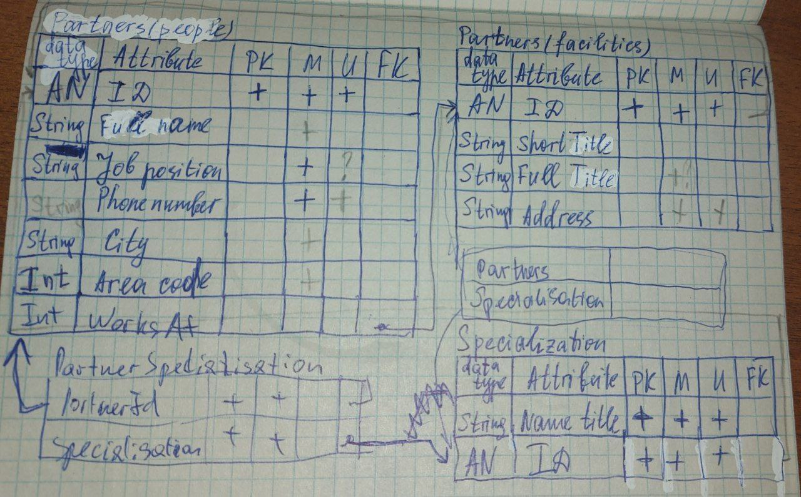

# Курс "Базы данных"   

## Полезная (надеюсь) теория  

### From ERD to relational model  
- [Статейка](https://runestone.academy/ns/books/published/practical_db/PART2_DATA_MODELING/03-ERD-to-relational/ERD-to-relational.html)  
- [Про relational model](https://opentextbc.ca/dbdesign01/chapter/chapter-8-entity-relationship-model/)  
- [Differences](https://herovired.com/learning-hub/blogs/difference-between-primary-key-and-foreign-key/#:~:text=A%20primary%20key%20is%20a%20unique%20identifier%20for%20each%20record,primary%20key%20of%20another%20table.&text=Ensures%20uniqueness%20and%20data%20integrity%20within%20a%20single%20table.) between Primary Key and Foreign Key  
- [С хабра](https://habr.com/ru/articles/254773/) про нормальные формы  
- [3НФ и НФБК](https://neerc.ifmo.ru/wiki/index.php?title=%D0%9D%D0%BE%D1%80%D0%BC%D0%B0%D0%BB%D1%8C%D0%BD%D1%8B%D0%B5_%D1%84%D0%BE%D1%80%D0%BC%D1%8B:_%D1%82%D1%80%D0%B5%D1%82%D1%8C%D1%8F_%D0%B8_%D0%91%D0%BE%D0%B9%D1%81%D0%B0-%D0%9A%D0%BE%D0%B4%D0%B4%D0%B0)  
- [Про функциональные формы](https://habr.com/ru/companies/JetBrains-education/articles/473882/)  
- [Примеры про функциоинальные зависимости](https://www.bestprog.net/ru/2020/10/27/databases-normalization-functional-dependencies-of-attributes-examples-building-functional-dependency-diagrams-ru/#q01)
- [Еще примеры про Фз](https://opentextbc.ca/dbdesign01/chapter/chapter-11-functional-dependencies/) - примерчики с букавками  
- [Пример с презенташки чьей-то](http://www.myshared.ru/slide/728148/) 

## My project is "PHONEBOOK"  
### Описание проекта  
<h3 style="text-align:center;">Проект №2 «Телефонный справочник» </h3>  

Владелец телефонного справочника хранит в нем информацию о своих бизнес-партнерах (отдельных людях и фирмах) и проводит поиск нужных партнеров по различным критериям.  

#### Хранимые  данных:
    1. Партнеры (Люди)  
        - Ф.И.О.  
        - Должность  
        - Предприятие (может отсутствовать)
        - Телефон (несколько)
        - Название города
        - Код города
    2. Партнеры (Предприятия)  
        - Сокращенное название
        - Полное название
        - Адрес (город, индекс, улица, дом)
    3. Специализация
        - Наименование специализации (может иметь несколько значений, например, поставка нефти, поставка одежды, выпуск металлопроката и т.п.)  

#### Функциональность:
    1. Запрограммировать формы ввода новых и редактирования имеющихся данных в таблицах.
    2. Поиск: партнеров по специализации. Может быть уточнение (только людей, только фирмы)
    3. Поиск  телефона с кода города по Ф.И.О., по сокращенному названию предприятия.
    4. Вывод на экран названия предприятий и количество специализаций предприятия.

### ERD
There is an entity-relational diagram(ERD)  
   

### Relational model
There is a relational model  
  

